# Mod_4_visualization

``` r
library(tidyverse)
library(gridExtra)
library(ggthemes)
library(faraway)
library(dlnm)
data("chicagoNMMAPS")
data("worldcup")
```

## Basis plotting with ggplot2

`ggplot` is used to construct the initial ggplot object. It takes a
dataset in the form of a data frame as input. There are three patterns
used to invoke `ggplot()`

- `ggolot(data = df, aes(x, y, ...))`

  Uses the same data and aesthetics. Recommended when all layers use the
  dame data and the same set of aesthetics. Although other data can be
  added to other layers.

- `ggplot(data = df)`

  Specifies the base data but no aesthetics. Is best used when all
  layers are based on the same dataset but individual layers vary in the
  variables used for their respective aesthetics.

- `ggplot()`

  Initializes a bare `ggplot` skeleton, with no variable and/or
  aesthetic mapping. Useful when multiple datasets are used to combine
  layers.

`ggplot` is very specific about specifying aesthetics inside `aes`.

``` r
# Good
ggplot(worldcup, aes(x = Shots, y = Passes))

# Bad
ggplot(worldcup, x = Shots, y = Passes)
```

The `data` aargument has to be specified before or with the aesthetics.
If no dataset is specified within `ggplot()` but inside another `geom_*`
make sure to use the `data` argument as `data` is not the first
parameter expected in `geom` calls.

``` r
# Good
ggplot(worldcup, aes(x = Shots, y = Passes)) +
  geom_point()

ggplot(worldcup) +
  geom_point(aes(x = Shots, y = Passes))

ggplot() +
  geom_point(data = worldcup, aes(x = Shots, y = Passes))

# Bad
ggplot() +
  geom_point(worldcup, aes(x = Shots, y = Passes))
```

### Saving plots

To save a plot using code in a script, take the following steps: (1)
open a graphics device (e.g., using the function `pdf` or `png`) (2) run
the code and (3) close the graphics device using the `dev.off` function.
Note that the function you use to open a graphics device will depend on
the type of device you want to open, but you close all devices with the
same function (`dev.off`).

### Geoms

All geom functions have required and accepted aesthetics,
e.g. `geom_point` requires `x` and `y`, but the function also accepts
`alpha`, `color`, `fill`, `group`, `size`, `shape` and `stroke`.

``` r
# Basic scatterplot with required aesthetics only
ggplot(worldcup, aes(Time, Passes)) +
  geom_point()
```

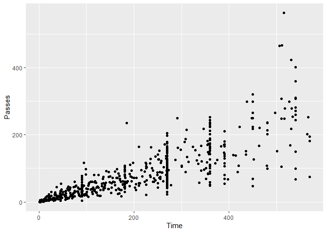

``` r
# Avanced visualization of the same data with additional aesthetics arguments
ggplot(worldcup, aes(Time, Passes,
                     color = Position,
                     size = Shots)) +
  geom_point()
```

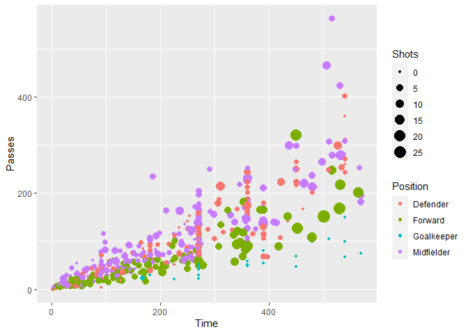

Combining several geoms in one plot allows us to create interesting
graphs, e.g. by adding highlights.

``` r
noteworthy_players <- worldcup %>% filter(Shots == max(Shots) | 
                                            Passes == max(Passes)) %>%
  mutate(point_label = paste(Team, Position, sep = ", "))

ggplot(worldcup, aes(x = Passes, y = Shots)) + 
  geom_point() + 
  # notice how the additional layer is added from a different df
  geom_text(data = noteworthy_players, aes(label = point_label), 
            # Label orientation
            vjust = "inward", hjust = "inward") 
```

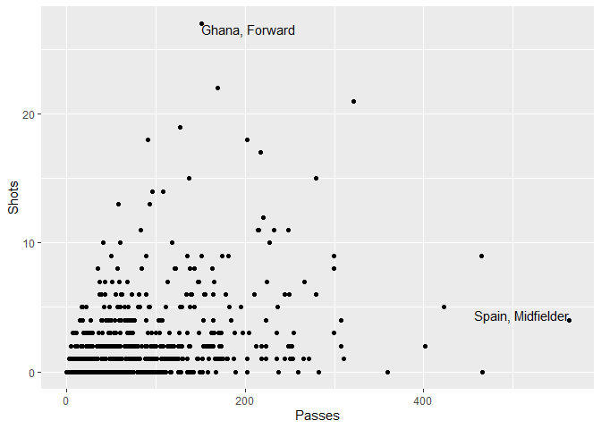

#### Using constant aesthetics

Instead of mapping an aesthetic to an element of the dataset, we can
apply a constant value. To do this, we specify the color aesthetic
outside of an `aes` call:

``` r
ggplot(worldcup, aes(x = Time, y = Passes)) + 
  geom_point(color = "darkred")
```

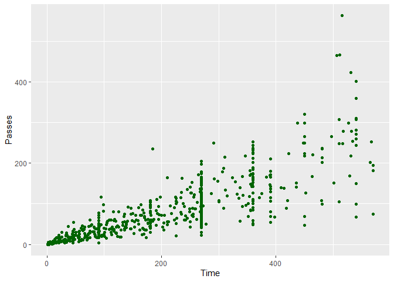

This can be applied to all geoms, including `fill`, `shape`, and `size`.
While `color` are specified by strings, `shape` is specified by a
numbere between 1 and 21.

#### Aesthetics inheritance

Once aesthetics are mapped, they are inherited by additional geoms.

``` r
ggplot(worldcup, aes(x = Time, y = Passes, color = Position)) + 
  geom_point() +
  theme_few()
```

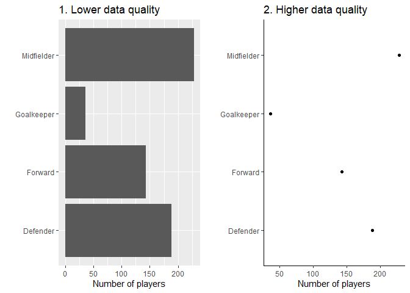

They can be overridden with the `aes` function inside the new geom.

``` r
ggplot(worldcup, aes(x = Time, y = Passes, color = Team)) + 
  geom_point() +
  theme_few() +
  theme(legend.position = "none")
```

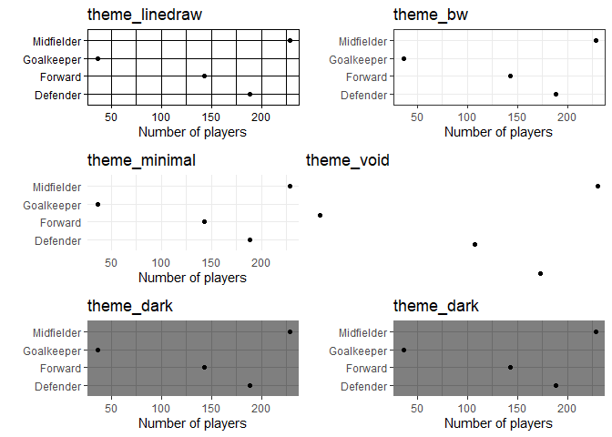

## Guidelines for good plots

The guidelines are:

- Aim for high data density

- Use clear, meaningful labels

- Provide useful references

- Highlight interesting aspects of the data

- Consider using small multiples

- Make order meaningful

### Aim for high data density

The ratio of “ink” to data should be kept as low as possible. Below are
two graphs displaying the same amount of information. Notice how the
right plot shows the same amount of information with minimal space.
Further, the right plot has the background color and grid lines removed.

``` r
h <- worldcup %>% 
  count(Position) %>% 
  ggplot(aes(n, factor(Position))) +
  geom_col() +
  ggtitle("1. Lower data quality") +
  xlab("Number of players") +
  ylab("")

e <- worldcup %>% 
  count(Position) %>% 
  ggplot(aes(n, factor(Position))) +
  geom_point() +
  theme_classic() + 
  ggtitle("2. Higher data quality") +
  xlab("Number of players") +
  ylab("")

grid.arrange(h, e, ncol = 2)
```

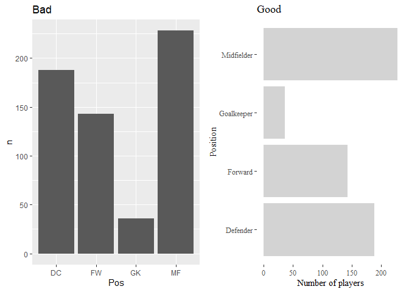

By increasing the data-to-ink ratio in a plot we ca help the viewers see
the data more quickly. A cluttered plot is harder to interpret. Further,
we leave some room to add additional data, references and highlights. A
major method for decreasing clutter in the plot is choosing the right
`theme`. A number of theme functions comes with `ggplot2`: -
`theme_linedraw` - `theme_bw` - `theme_minimal` - `theme_void` -
`theme_dark` - `theme_classic`

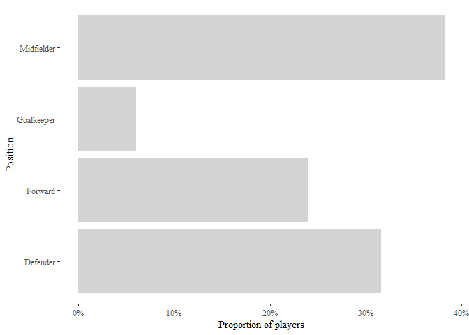

Additional themes are available with the `ggthemes` package.

### Use clear, meaningful labels

The default for `ggplot2` is to use column names as axis labels. While
this is convenient for exploratory plots, it is not adequate for
presentations and publications. For EDA we can stick to short names like
“wt”, but should use longer, precise labeling for another audience
(“Weight \[kg\]”). If variables require longer labels, consider flipping
the axes with `coord_flip`.

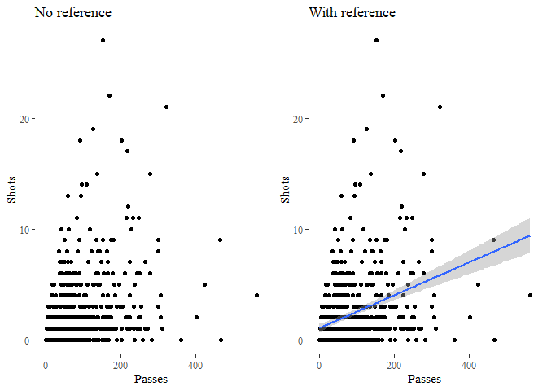

Include units of measurement - where relevant - in axis titles or tick
marks. The `scale_*` (e.g. `scale_x_continuous`) from the `scales`
package offer lots of customization via the `name`, `labels` or `scale`
arguments.

``` r
worldcup %>% 
  count(Position) %>% 
  mutate(total = sum(n),
         prop = round(n * 100 / total, 2)) %>% 
  ggplot(aes(Position, prop)) +
  geom_col(fill = "lightgrey") +
  scale_y_continuous("Proportion of players", 
                     labels = scales::label_percent(scale  = 1)) +
  coord_flip() +
  ggthemes::theme_tufte()
```

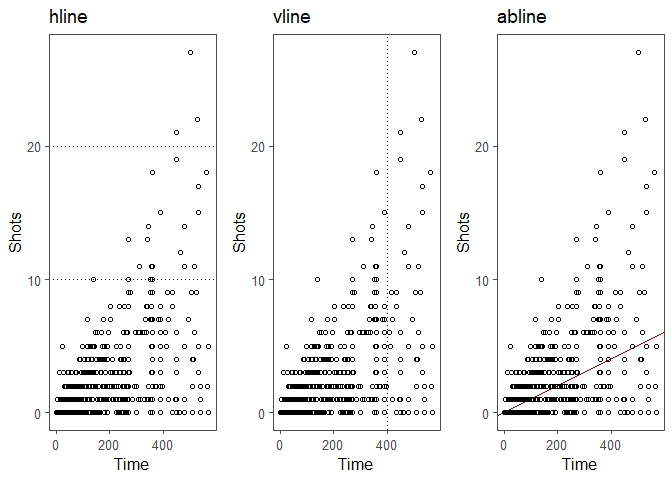

### Provide useful references

Adding reference values is a great way to present outliers in the data.
One way of adding reference is by showing trends and relationships
between variables, e.g. by adding a linear or smooth function.

``` r
n <- ggplot(worldcup, aes(Passes, Shots)) +
  geom_point()+
  ggtitle("No reference") +
  theme_tufte()

r <- ggplot(worldcup, aes(Passes, Shots)) +
  geom_point()+
  geom_smooth(formula = y ~ x, method = "lm") +
  ggtitle("With reference") +
  theme_tufte()

grid.arrange(n, r, ncol = 2)
```

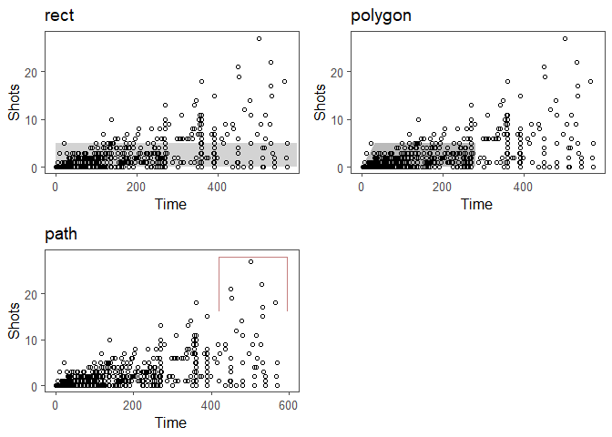

Some considerations for adding references: - Add reference layers
first - Add transparency `alpha` - Use neutral colors (greys) - Use
non-solid lines (`linetype = 3`)

Other helpful functions for adding references - or highlights - are:

- `geom_hline` and `geom_vline` for horizontal and vertical lines,
  respectively

- `geom_abline` adds a line with an intercept and a slope

- `geom_rect` adds a filled rectangle

- `geom_poly` adds a filled polygon

- `geom_path` adds an empty polygon

``` r
h <- ggplot(worldcup, aes(Time, Shots)) +
  geom_hline(yintercept = c(10, 20), linetype = 3) + 
  geom_point(shape = 1) +
  theme_few() +
  ggtitle("hline")

v <- ggplot(worldcup, aes(Time, Shots)) +
  geom_vline(xintercept = 400, linetype = 3) + 
  geom_point(shape = 1) +
  theme_few() +
  ggtitle("vline")

a <- ggplot(worldcup, aes(Time, Shots)) +
  geom_abline(intercept = 0, slope = 0.01, color = "darkred") + 
  geom_point(shape = 1) +
  theme_few() +
  ggtitle("abline")

grid.arrange(h, v, a, ncol = 3)
```

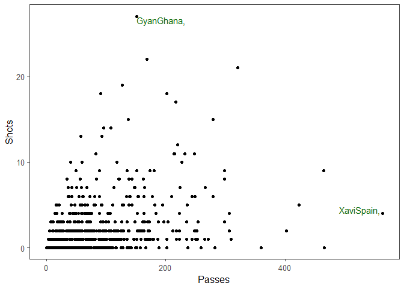

``` r
r <- ggplot(worldcup, aes(Time, Shots)) +
  geom_rect(xmin = 0, xmax = 595, ymin = 0, ymax = 5, fill = "lightgrey", alpha = 0.8) + 
  geom_point(shape = 1) +
  theme_few() +
  ggtitle("rect")

pl <- ggplot(worldcup, aes(Time, Shots)) +
  geom_polygon(data = data.frame(x = c(0, 30, 280, 280),
                                 y = c(0, 5, 5, 0)),
               aes(x = x, y = y),
               alpha = 0.8,
               fill = "darkgrey") + 
  geom_point(shape = 1) +
  theme_few() +
  ggtitle("polygon")

pa <- ggplot(worldcup, aes(Time, Shots)) +
  geom_path(data = data.frame(x = c(420, 420, 595, 595),
                                 y = c(16, 28, 28, 16)),
            aes(x = x, y = y),
            alpha = 0.5,
            color = "darkred",
            linetype = 1,
            size = 0.7) + 
  geom_point(shape = 1) +
  theme_few() +
  ggtitle("path")
```

    Warning: Using `size` aesthetic for lines was deprecated in ggplot2 3.4.0.
    ℹ Please use `linewidth` instead.

``` r
grid.arrange(r, pl, pa, ncol = 2)
```

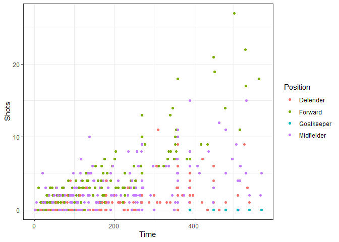

Adding test is another great way of highlighting features of the data.
Hightlighting layers like `geom_text` often require a designated
dataset.

``` r
top_players <- worldcup %>% 
  filter(Passes == max(Passes) | Shots == max(Shots)) %>% 
  mutate(Name = rownames(.),
         Label = paste0(Name, Team, sep = ', '))

ggplot(worldcup, aes(Passes, Shots)) +
  geom_point() +
  geom_text(data = top_players, aes(label = Label),
            vjust = "inward", hjust = "inward",
            color = "darkgreen") +
  theme_few()
```

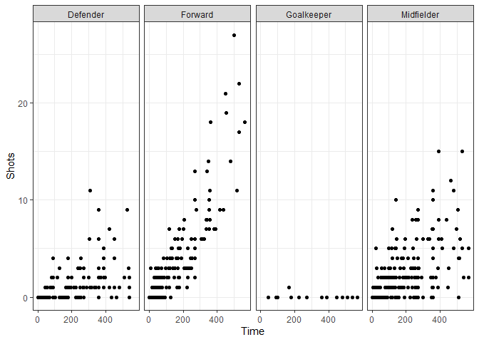

### Use small multiplets

Multiplets are small plots with the same x- and y-axes showing different
subsets of the data. They are a great way to de-clutter busy plots.


``` r
ggplot(worldcup, aes(Time, Shots)) + 
  geom_point() +
  theme_bw() +
  facet_grid(. ~ Position)
```

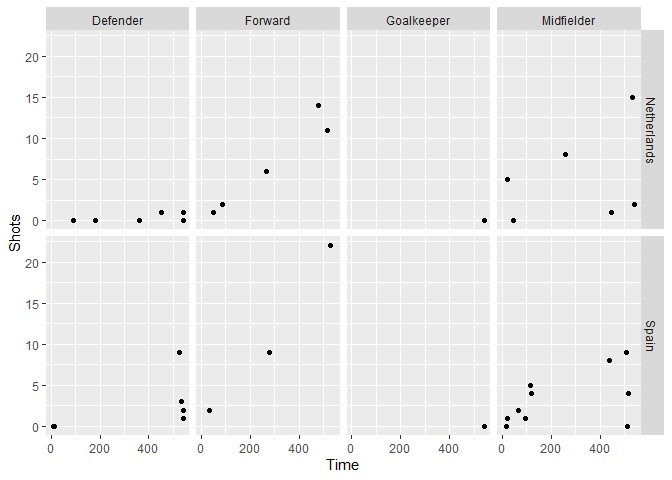

\`facet_grid\` can facet by either rows or columns, or both.

``` r
facet_grid([factor for rows] ~ [facet for cloumns])
```

``` r
worldcup %>%
  filter(Team %in% c("Spain", "Netherlands")) %>%
  ggplot(aes(x = Time, y = Shots)) + 
  geom_point() +
  facet_grid(Team ~ Position) 
```

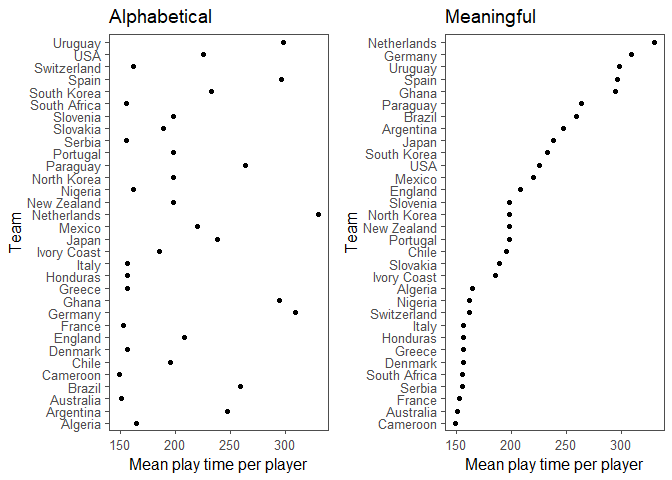

While `facet_grid` is best used for two discrete variables and all
combinations of the variables are available, `facet_wrap` is best used
for one variable with many levels.

``` r
worldcup %>%
  ggplot(aes(x = Time, y = Shots)) + 
  geom_point(alpha = 0.25) +
  facet_wrap(~ Team, ncol = 6) 
```

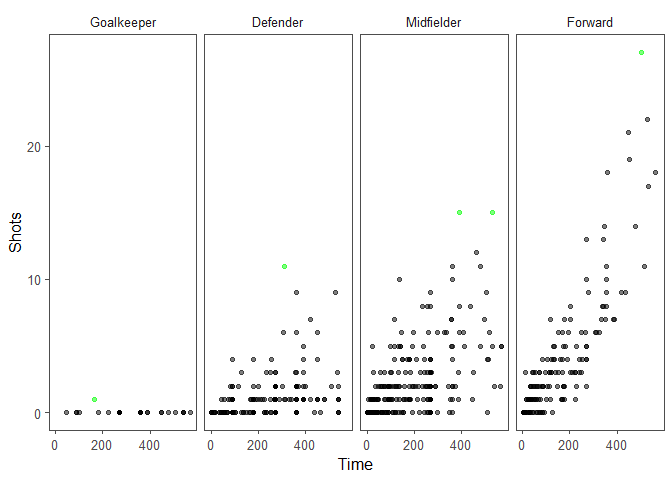

### Make order meaningful

Using meaningful arrangement of data makes interpretation of plots
easier. Here, use the `factor()` function to re-order factor variables
and change the ordering via the `levels` variable.

``` r
a <- worldcup %>% 
  group_by(Team) %>% 
  summarise(Time = mean(Time)) %>% 
  ggplot(aes(Time, Team)) +
  geom_point() +
  theme_few() +
  xlab("Mean play time per player") +
  ggtitle("Alphabetical")

b <- worldcup %>% 
  group_by(Team) %>% 
  summarise(Time = mean(Time)) %>% 
  arrange(Time) %>% 
  mutate(Team = factor(Team, levels = Team)) %>% 
  ggplot(aes(Time, Team)) +
  geom_point() +
  theme_few() +
  xlab("Mean play time per player")+
  ggtitle("Meaningful")

grid.arrange(a, b, ncol = 2)
```

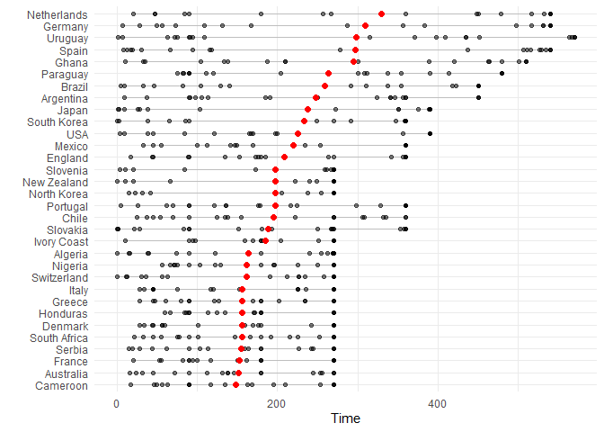

We can also use a variable of interest to order multiplets. Here, we use
the average number of shots taken to order player positions.

``` r
worldcup %>%
  select(Position, Time, Shots) %>%
  group_by(Position) %>%
  mutate(avg_shots = mean(Shots),
         most_shots = Shots == max(Shots)) %>%
  ungroup() %>%
  arrange(avg_shots) %>%
  mutate(Position = factor(Position, levels = unique(Position))) %>%
  ggplot(aes(x = Time, y = Shots, color = most_shots)) + 
  geom_point(alpha = 0.5) + 
  scale_color_manual(values = c("TRUE" = "green", "FALSE" = "black"),
                     guide = FALSE) + 
  facet_grid(. ~ Position) + 
  theme_few()
```

    Warning: The `guide` argument in `scale_*()` cannot be `FALSE`. This was deprecated in
    ggplot2 3.3.4.
    ℹ Please use "none" instead.


``` r
worldcup %>%
  select(Team, Time) %>%
  group_by(Team) %>%
  mutate(t_avg = mean(Time),
                t_min = min(Time),
                t_max = max(Time)) %>%
  arrange(t_avg) %>%
  ungroup() %>%
  mutate(Team = factor(Team, levels = unique(Team))) %>%
  ggplot(aes(Time, Team)) + 
  geom_segment(aes(x = t_min, xend = t_max, yend = Team),
               alpha = 0.5, color = "gray") + 
  geom_point(alpha = 0.5) + 
  geom_point(aes(x = t_avg), size = 2, color = "red", alpha = 0.5) + 
  theme_minimal() + 
  ylab("")
```


## Colors and scales

## Mapping

``` r
library(maps)
```


    Attaching package: 'maps'

    The following object is masked from 'package:faraway':

        ozone

    The following object is masked from 'package:purrr':

        map

``` r
library(viridis)
```

    Loading required package: viridisLite


    Attaching package: 'viridis'

    The following object is masked from 'package:maps':

        unemp

``` r
# library(ggmap)
```

The most basic way of mapping is by assigning longitude to the x
aesthetic and ltitude to the y aesthetic. `ggplot` includes a few
dataset, which can be accessed with the `map_data` function.

``` r
us_map <- map_data("state")
head(us_map)
```

           long      lat group order  region subregion
    1 -87.46201 30.38968     1     1 alabama      <NA>
    2 -87.48493 30.37249     1     2 alabama      <NA>
    3 -87.52503 30.37249     1     3 alabama      <NA>
    4 -87.53076 30.33239     1     4 alabama      <NA>
    5 -87.57087 30.32665     1     5 alabama      <NA>
    6 -87.58806 30.32665     1     6 alabama      <NA>

``` r
us_map %>% 
  filter(region == "michigan") %>% 
  ggplot(aes(long, lat)) +
  geom_point() +
  theme_void()
```

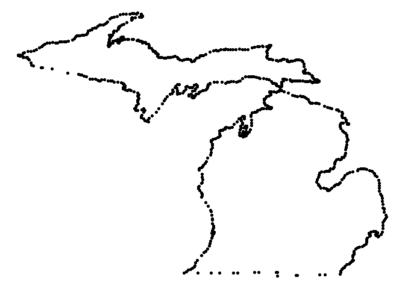

Using lines requires a `group` aesthetic otherwise all line will be
connected

``` r
us_map %>% 
  filter(region == "michigan") %>% 
  ggplot(aes(long, lat)) +
  geom_path() +
  theme_void()
```

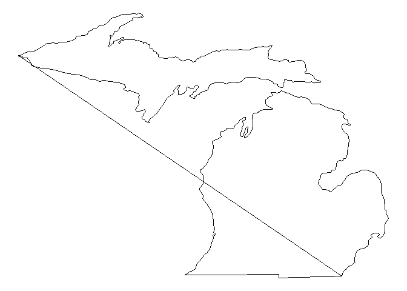

``` r
us_map %>% 
  filter(region == "michigan") %>% 
  ggplot(aes(long, lat, group = group)) +
  geom_path() +
  theme_void()
```

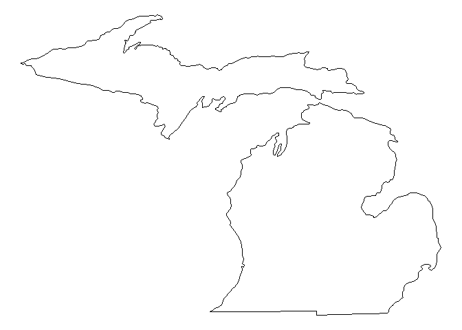

`geom_path` is the preferred geom over `geom_line` for drawing maps
because `geom_path` connects the x-axis values based on their order in
the data frame.`geom_line` connects x-axis values by their order on the
axis - which is great for statistical graphs.

`geom_polygon` can bu used to apply color fill to map areas within their
borders.

``` r
us_map %>% 
  filter(region == "michigan") %>% 
  ggplot(aes(long, lat, group = group)) +
  geom_polygon(fill = "skyblue", color = "blue") +
  theme_void()
```

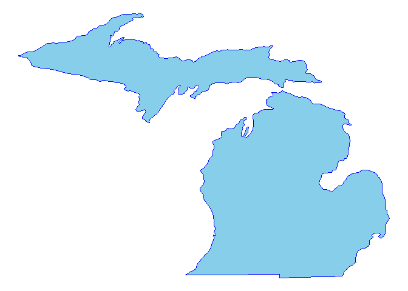

To make a choropleth map we can use the `viridis` package and map a
continuous variable to the `scale_fill_viridis` function.

``` r
data(votes.repub)
head(votes.repub)
```

                1856  1860  1864  1868  1872  1876  1880  1884  1888  1892  1896
    Alabama       NA    NA    NA 51.44 53.19 40.02 36.98 38.44 32.28  3.95 28.13
    Alaska        NA    NA    NA    NA    NA    NA    NA    NA    NA    NA    NA
    Arizona       NA    NA    NA    NA    NA    NA    NA    NA    NA    NA    NA
    Arkansas      NA    NA    NA 53.73 52.17 39.88 39.55 40.50 38.07 32.01 25.11
    California 18.77 32.96 58.63 50.24 56.38 50.88 48.92 52.08 49.95 43.76 49.13
    Colorado      NA    NA    NA    NA    NA    NA 51.28 54.39 55.31 41.13 13.84
                1900  1904  1908  1912  1916  1920  1924  1928  1932  1936  1940
    Alabama    34.67 20.65 24.38  8.26 21.97 30.98 27.01 48.49 14.15 12.82 14.34
    Alaska        NA    NA    NA    NA    NA    NA    NA    NA    NA    NA    NA
    Arizona       NA    NA    NA 12.74 35.37 55.41 41.26 57.57 30.53 26.93 36.01
    Arkansas   35.04 40.25 37.31 19.73 28.01 38.73 29.28 39.33 12.91 17.86 20.87
    California 54.48 61.90 55.46  0.58 46.26 66.24 57.21 64.70 37.40 31.70 41.35
    Colorado   42.04 55.27 46.88 21.88 34.75 59.32 57.02 64.72 41.43 37.09 50.92
                1944  1948  1952  1956  1960 1964 1968 1972  1976
    Alabama    18.20 19.04 35.02 39.39 41.75 69.5 14.0 72.4 43.48
    Alaska        NA    NA    NA    NA 50.94 34.1 45.3 58.1 62.91
    Arizona    40.90 43.82 58.35 60.99 55.52 50.4 54.8 64.7 58.62
    Arkansas   29.84 21.02 43.76 45.82 43.06 43.9 30.8 68.9 34.97
    California 42.99 47.14 56.39 55.40 50.10 40.9 47.8 55.0 50.89
    Colorado   53.21 46.52 60.27 59.49 54.63 38.7 50.5 62.6 55.89

``` r
votes.repub %>%
  as_tibble() %>%
  mutate(state = rownames(votes.repub),
         state = tolower(state)) %>%
  right_join(us_map, by = c("state" = "region")) %>%
  ggplot(aes(x = long, y = lat, group = group, fill = `1968`)) +
  geom_polygon(color = "black") + 
  theme_void() + 
  scale_fill_viridis(name = "Republican\nvotes [%]")
```

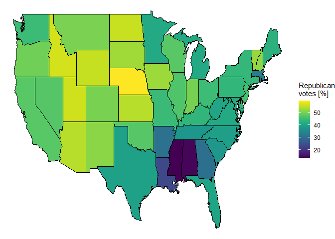

### Spatial objects

``` r
library(tigris)
```

    Warning: package 'tigris' was built under R version 4.3.3

    To enable caching of data, set `options(tigris_use_cache = TRUE)`
    in your R script or .Rprofile.

``` r
library(sp)
```

    Warning: package 'sp' was built under R version 4.3.3

Geographic data is often stored in spatial objects: `SpacialPolygons`
`SpatialPoints` `SpatialLines` `SpatialPolygonsDataFrame`
`SpatialPointsDataFrame` `SpatialLinessDataFrame`

The `tigris` package pulls spatial data from the US Census. Results can
be specified with the `state` and `county` parameters, while
`cb = FALSE` can be set for a low resolution file.


      |                                                                            
      |                                                                      |   0%
      |                                                                            
      |=                                                                     |   1%
      |                                                                            
      |==                                                                    |   3%
      |                                                                            
      |===                                                                   |   5%
      |                                                                            
      |====                                                                  |   6%
      |                                                                            
      |=====                                                                 |   7%
      |                                                                            
      |======                                                                |   9%
      |                                                                            
      |=======                                                               |   9%
      |                                                                            
      |========                                                              |  11%
      |                                                                            
      |========                                                              |  12%
      |                                                                            
      |=========                                                             |  13%
      |                                                                            
      |==========                                                            |  15%
      |                                                                            
      |===========                                                           |  15%
      |                                                                            
      |============                                                          |  17%
      |                                                                            
      |============                                                          |  18%
      |                                                                            
      |=============                                                         |  19%
      |                                                                            
      |==============                                                        |  20%
      |                                                                            
      |===============                                                       |  21%
      |                                                                            
      |================                                                      |  23%
      |                                                                            
      |=================                                                     |  25%
      |                                                                            
      |==================                                                    |  26%
      |                                                                            
      |===================                                                   |  27%
      |                                                                            
      |====================                                                  |  29%
      |                                                                            
      |=====================                                                 |  29%
      |                                                                            
      |======================                                                |  31%
      |                                                                            
      |=======================                                               |  32%
      |                                                                            
      |=======================                                               |  33%
      |                                                                            
      |========================                                              |  35%
      |                                                                            
      |=========================                                             |  35%
      |                                                                            
      |==========================                                            |  37%
      |                                                                            
      |===========================                                           |  38%
      |                                                                            
      |===========================                                           |  39%
      |                                                                            
      |============================                                          |  40%
      |                                                                            
      |=============================                                         |  41%
      |                                                                            
      |==============================                                        |  43%
      |                                                                            
      |===============================                                       |  44%
      |                                                                            
      |===============================                                       |  45%
      |                                                                            
      |================================                                      |  46%
      |                                                                            
      |=================================                                     |  47%
      |                                                                            
      |==================================                                    |  49%
      |                                                                            
      |===================================                                   |  50%
      |                                                                            
      |====================================                                  |  51%
      |                                                                            
      |=====================================                                 |  52%
      |                                                                            
      |=====================================                                 |  53%
      |                                                                            
      |======================================                                |  55%
      |                                                                            
      |=======================================                               |  56%
      |                                                                            
      |========================================                              |  57%
      |                                                                            
      |=========================================                             |  58%
      |                                                                            
      |=========================================                             |  59%
      |                                                                            
      |==========================================                            |  60%
      |                                                                            
      |===========================================                           |  62%
      |                                                                            
      |============================================                          |  63%
      |                                                                            
      |=============================================                         |  64%
      |                                                                            
      |=============================================                         |  65%
      |                                                                            
      |==============================================                        |  66%
      |                                                                            
      |===============================================                       |  68%
      |                                                                            
      |================================================                      |  69%
      |                                                                            
      |=================================================                     |  70%
      |                                                                            
      |==================================================                    |  71%
      |                                                                            
      |===================================================                   |  72%
      |                                                                            
      |====================================================                  |  74%
      |                                                                            
      |=====================================================                 |  76%
      |                                                                            
      |======================================================                |  77%
      |                                                                            
      |=======================================================               |  78%
      |                                                                            
      |========================================================              |  80%
      |                                                                            
      |=========================================================             |  82%
      |                                                                            
      |==========================================================            |  83%
      |                                                                            
      |===========================================================           |  84%
      |                                                                            
      |============================================================          |  86%
      |                                                                            
      |=============================================================         |  88%
      |                                                                            
      |==============================================================        |  89%
      |                                                                            
      |===============================================================       |  90%
      |                                                                            
      |================================================================      |  92%
      |                                                                            
      |=================================================================     |  92%
      |                                                                            
      |==================================================================    |  94%
      |                                                                            
      |===================================================================   |  96%
      |                                                                            
      |====================================================================  |  97%
      |                                                                            
      |===================================================================== |  98%
      |                                                                            
      |======================================================================| 100%

``` r
plot(denver_tracts)
```

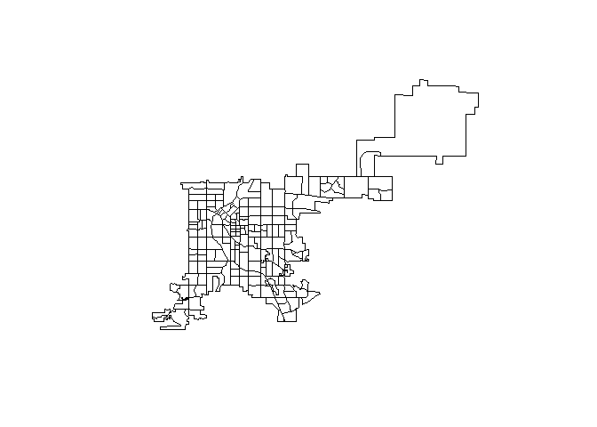

The `bbox` function retrieves the longitude and latitude of the bounding
box.

``` r
bbox(denver_tracts)
```

             min        max
    x -105.10992 -104.59958
    y   39.61433   39.91418

If the object is a dataframe, we can access it with the `@` operator.

``` r
class(denver_tracts)
```

    [1] "SpatialPolygonsDataFrame"
    attr(,"package")
    [1] "sp"

``` r
head(denver_tracts@data)
```

       STATEFP COUNTYFP TRACTCE             AFFGEOID       GEOID  NAME
    28      08      031  000904 1400000US08031000904 08031000904  9.04
    29      08      031  000800 1400000US08031000800 08031000800     8
    30      08      031  004801 1400000US08031004801 08031004801 48.01
    31      08      031  002402 1400000US08031002402 08031002402 24.02
    32      08      031  004201 1400000US08031004201 08031004201 42.01
    33      08      031  002902 1400000US08031002902 08031002902 29.02
                 NAMELSAD STUSPS    NAMELSADCO STATE_NAME LSAD   ALAND AWATER
    28  Census Tract 9.04     CO Denver County   Colorado   CT 1241246      0
    29     Census Tract 8     CO Denver County   Colorado   CT 1655100      0
    30 Census Tract 48.01     CO Denver County   Colorado   CT 1401480      0
    31 Census Tract 24.02     CO Denver County   Colorado   CT  411253      0
    32 Census Tract 42.01     CO Denver County   Colorado   CT 1904500      0
    33 Census Tract 29.02     CO Denver County   Colorado   CT 1263474      0

Just like with `ggplot` geoms, spatial objects can be layered over one
another. To do that we can set `add = TRUE` in the added layer.

    Retrieving data for the year 2022


      |                                                                            
      |                                                                      |   0%
      |                                                                            
      |                                                                      |   1%
      |                                                                            
      |=                                                                     |   1%
      |                                                                            
      |=                                                                     |   2%
      |                                                                            
      |==                                                                    |   2%
      |                                                                            
      |==                                                                    |   3%
      |                                                                            
      |===                                                                   |   4%
      |                                                                            
      |===                                                                   |   5%
      |                                                                            
      |====                                                                  |   5%
      |                                                                            
      |====                                                                  |   6%
      |                                                                            
      |=====                                                                 |   6%
      |                                                                            
      |=====                                                                 |   7%
      |                                                                            
      |=====                                                                 |   8%
      |                                                                            
      |======                                                                |   8%
      |                                                                            
      |======                                                                |   9%
      |                                                                            
      |=======                                                               |   9%
      |                                                                            
      |=======                                                               |  10%
      |                                                                            
      |=======                                                               |  11%
      |                                                                            
      |========                                                              |  11%
      |                                                                            
      |========                                                              |  12%
      |                                                                            
      |=========                                                             |  12%
      |                                                                            
      |=========                                                             |  13%
      |                                                                            
      |=========                                                             |  14%
      |                                                                            
      |==========                                                            |  14%
      |                                                                            
      |==========                                                            |  15%
      |                                                                            
      |===========                                                           |  15%
      |                                                                            
      |===========                                                           |  16%
      |                                                                            
      |============                                                          |  16%
      |                                                                            
      |============                                                          |  17%
      |                                                                            
      |============                                                          |  18%
      |                                                                            
      |=============                                                         |  18%
      |                                                                            
      |=============                                                         |  19%
      |                                                                            
      |==============                                                        |  19%
      |                                                                            
      |==============                                                        |  20%
      |                                                                            
      |==============                                                        |  21%
      |                                                                            
      |===============                                                       |  21%
      |                                                                            
      |===============                                                       |  22%
      |                                                                            
      |================                                                      |  22%
      |                                                                            
      |================                                                      |  23%
      |                                                                            
      |================                                                      |  24%
      |                                                                            
      |=================                                                     |  24%
      |                                                                            
      |=================                                                     |  25%
      |                                                                            
      |==================                                                    |  25%
      |                                                                            
      |==================                                                    |  26%
      |                                                                            
      |===================                                                   |  26%
      |                                                                            
      |===================                                                   |  27%
      |                                                                            
      |===================                                                   |  28%
      |                                                                            
      |====================                                                  |  28%
      |                                                                            
      |====================                                                  |  29%
      |                                                                            
      |=====================                                                 |  29%
      |                                                                            
      |=====================                                                 |  30%
      |                                                                            
      |=====================                                                 |  31%
      |                                                                            
      |======================                                                |  31%
      |                                                                            
      |======================                                                |  32%
      |                                                                            
      |=======================                                               |  32%
      |                                                                            
      |=======================                                               |  33%
      |                                                                            
      |=======================                                               |  34%
      |                                                                            
      |========================                                              |  34%
      |                                                                            
      |========================                                              |  35%
      |                                                                            
      |=========================                                             |  35%
      |                                                                            
      |=========================                                             |  36%
      |                                                                            
      |==========================                                            |  36%
      |                                                                            
      |==========================                                            |  37%
      |                                                                            
      |==========================                                            |  38%
      |                                                                            
      |===========================                                           |  38%
      |                                                                            
      |===========================                                           |  39%
      |                                                                            
      |============================                                          |  39%
      |                                                                            
      |============================                                          |  40%
      |                                                                            
      |============================                                          |  41%
      |                                                                            
      |=============================                                         |  41%
      |                                                                            
      |=============================                                         |  42%
      |                                                                            
      |==============================                                        |  42%
      |                                                                            
      |==============================                                        |  43%
      |                                                                            
      |==============================                                        |  44%
      |                                                                            
      |===============================                                       |  44%
      |                                                                            
      |===============================                                       |  45%
      |                                                                            
      |================================                                      |  45%
      |                                                                            
      |================================                                      |  46%
      |                                                                            
      |=================================                                     |  46%
      |                                                                            
      |=================================                                     |  47%
      |                                                                            
      |=================================                                     |  48%
      |                                                                            
      |==================================                                    |  48%
      |                                                                            
      |==================================                                    |  49%
      |                                                                            
      |===================================                                   |  49%
      |                                                                            
      |===================================                                   |  50%
      |                                                                            
      |===================================                                   |  51%
      |                                                                            
      |====================================                                  |  51%
      |                                                                            
      |====================================                                  |  52%
      |                                                                            
      |=====================================                                 |  52%
      |                                                                            
      |=====================================                                 |  53%
      |                                                                            
      |=====================================                                 |  54%
      |                                                                            
      |======================================                                |  54%
      |                                                                            
      |======================================                                |  55%
      |                                                                            
      |=======================================                               |  55%
      |                                                                            
      |=======================================                               |  56%
      |                                                                            
      |========================================                              |  56%
      |                                                                            
      |========================================                              |  57%
      |                                                                            
      |========================================                              |  58%
      |                                                                            
      |=========================================                             |  58%
      |                                                                            
      |=========================================                             |  59%
      |                                                                            
      |==========================================                            |  59%
      |                                                                            
      |==========================================                            |  60%
      |                                                                            
      |==========================================                            |  61%
      |                                                                            
      |===========================================                           |  61%
      |                                                                            
      |===========================================                           |  62%
      |                                                                            
      |============================================                          |  62%
      |                                                                            
      |============================================                          |  63%
      |                                                                            
      |============================================                          |  64%
      |                                                                            
      |=============================================                         |  64%
      |                                                                            
      |=============================================                         |  65%
      |                                                                            
      |==============================================                        |  65%
      |                                                                            
      |==============================================                        |  66%
      |                                                                            
      |===============================================                       |  66%
      |                                                                            
      |===============================================                       |  67%
      |                                                                            
      |===============================================                       |  68%
      |                                                                            
      |================================================                      |  68%
      |                                                                            
      |================================================                      |  69%
      |                                                                            
      |=================================================                     |  69%
      |                                                                            
      |=================================================                     |  70%
      |                                                                            
      |=================================================                     |  71%
      |                                                                            
      |==================================================                    |  71%
      |                                                                            
      |==================================================                    |  72%
      |                                                                            
      |===================================================                   |  72%
      |                                                                            
      |===================================================                   |  73%
      |                                                                            
      |===================================================                   |  74%
      |                                                                            
      |====================================================                  |  74%
      |                                                                            
      |====================================================                  |  75%
      |                                                                            
      |=====================================================                 |  75%
      |                                                                            
      |=====================================================                 |  76%
      |                                                                            
      |======================================================                |  76%
      |                                                                            
      |======================================================                |  77%
      |                                                                            
      |======================================================                |  78%
      |                                                                            
      |=======================================================               |  78%
      |                                                                            
      |=======================================================               |  79%
      |                                                                            
      |========================================================              |  79%
      |                                                                            
      |========================================================              |  80%
      |                                                                            
      |========================================================              |  81%
      |                                                                            
      |=========================================================             |  81%
      |                                                                            
      |=========================================================             |  82%
      |                                                                            
      |==========================================================            |  82%
      |                                                                            
      |==========================================================            |  83%
      |                                                                            
      |==========================================================            |  84%
      |                                                                            
      |===========================================================           |  84%
      |                                                                            
      |===========================================================           |  85%
      |                                                                            
      |============================================================          |  85%
      |                                                                            
      |============================================================          |  86%
      |                                                                            
      |=============================================================         |  86%
      |                                                                            
      |=============================================================         |  87%
      |                                                                            
      |=============================================================         |  88%
      |                                                                            
      |==============================================================        |  88%
      |                                                                            
      |==============================================================        |  89%
      |                                                                            
      |===============================================================       |  90%
      |                                                                            
      |===============================================================       |  91%
      |                                                                            
      |================================================================      |  91%
      |                                                                            
      |================================================================      |  92%
      |                                                                            
      |=================================================================     |  92%
      |                                                                            
      |=================================================================     |  93%
      |                                                                            
      |=================================================================     |  94%
      |                                                                            
      |==================================================================    |  94%
      |                                                                            
      |==================================================================    |  95%
      |                                                                            
      |===================================================================   |  95%
      |                                                                            
      |===================================================================   |  96%
      |                                                                            
      |====================================================================  |  96%
      |                                                                            
      |====================================================================  |  97%
      |                                                                            
      |====================================================================  |  98%
      |                                                                            
      |===================================================================== |  98%
      |                                                                            
      |===================================================================== |  99%
      |                                                                            
      |======================================================================|  99%
      |                                                                            
      |======================================================================| 100%

``` r
plot(denver_tracts, col = "lightgrey")
plot(roads, col = "darkred", add = TRUE)
```

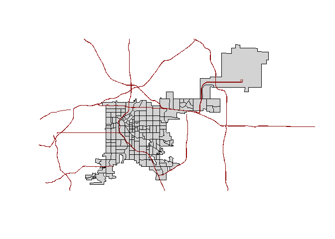

With the `sp` package data stored in data frames can be converted into
spatial objects. For using spatial objects with `ggplot2` we can convert
them with the `tidy` function from the `broom` package.

``` r
denver_tracts_df <- broom::tidy(denver_tracts)
```

    Warning: `tidy.SpatialPolygonsDataFrame()` was deprecated in broom 1.0.4.
    ℹ Please use functions from the sf package, namely `sf::st_as_sf()`, in favor
      of sp tidiers.

    Regions defined for each Polygons

``` r
denver_tracts_df %>% 
  select(1:4) %>% 
  slice(1:5)
```

    # A tibble: 5 × 4
       long   lat order hole 
      <dbl> <dbl> <int> <lgl>
    1 -105.  39.7     1 FALSE
    2 -105.  39.7     2 FALSE
    3 -105.  39.7     3 FALSE
    4 -105.  39.7     4 FALSE
    5 -105.  39.7     5 FALSE

``` r
ggplot(denver_tracts_df, aes(long, lat, group = group)) +
  geom_polygon(fill = "lightgrey", color = "black") +
  theme_void()
```

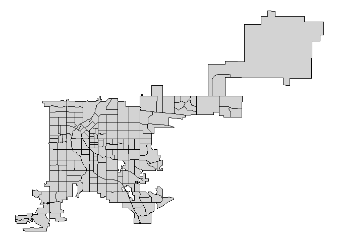

### htmlWidgets

#### `plolty`
